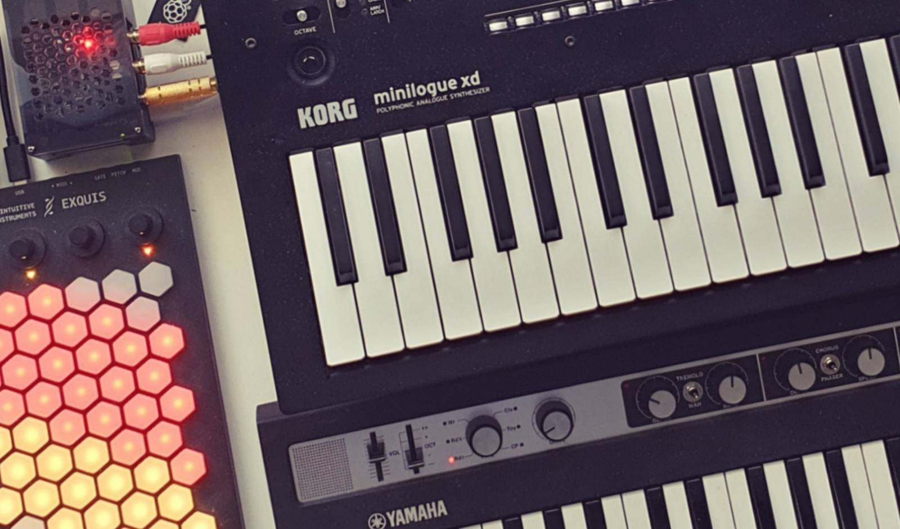
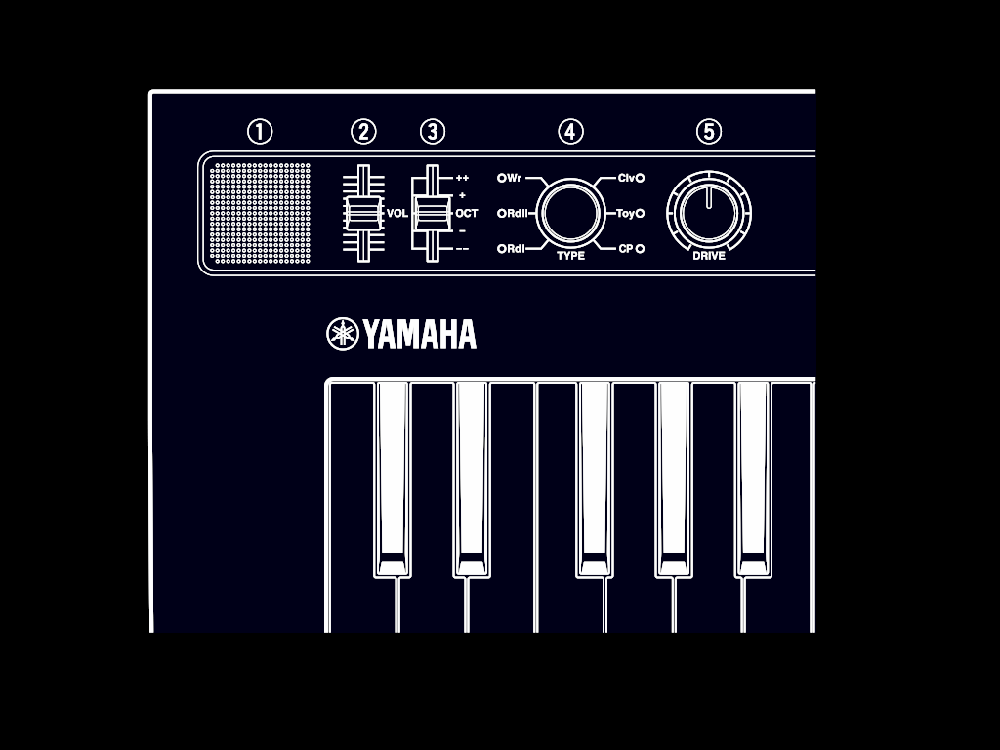
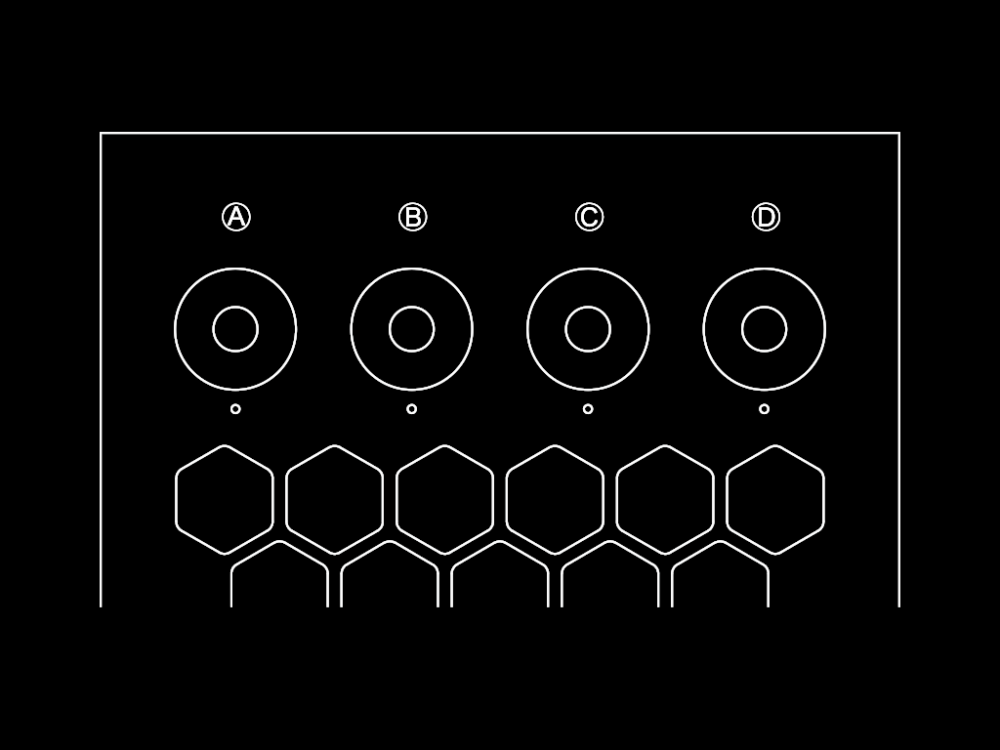
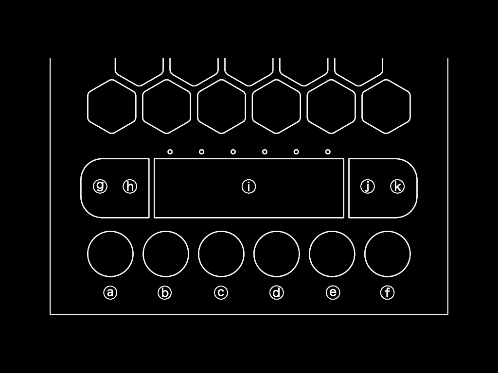
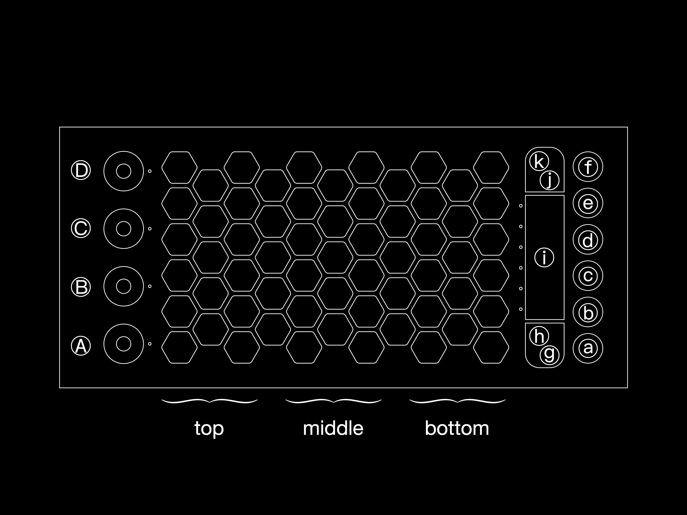

# microtonOS

Making a xenharmonic synth out of a Raspberry Pi.
Most microtonal/xenharmonic products are geared towards music production—microtonOS is not.
microtonOS is a synthesiser meant for jamming.
You can jam by yourself and discover different music cultures as well as experimental approaches to harmony.
Or, you can use one of the many connectivity options on the Raspberry Pi to add additional instruments played by friends.
At first glance, microtonOS is ticking all the boxes.
It is screen-free, and, at its height, visual feedback is a somewhat culture-agnostic geometric representation of the tuning system.
The microtonOS code can be readily adapted to work with a minimum hardware requirement of 1 midi controller + 1 Linux computer.
Below is a brief demo of maqam saba in 9ed3/2 tuning on piano.

https://github.com/user-attachments/assets/df7541df-ebf6-41b0-8a2d-45e2938c4093


## Components
**Raspberry Pi.**
I use a Raspberry Pi 5 8GB RAM together with:
- Official powersupply (5.1V, 5.0A/9.0V, 3.0A/12.0V, 2.25A, 15.0V 1.8A, and 27W)
- Inno-Maker Raspberry Pi 5 Aluminum Case (with combined fan and heatsink)
- Geeekpi GPIO pin header extension
- HifiBerry ADC plus DAC soundcard
- 64GB Sandisk Pro Extreme SD card

(Get the Raspberry Pi with the fastest CPU. It is usually the latest generation.
As for RAM, it needs at least 4GB.
Alternatives to HifiBerry include Zynthian and Blokas Pisound.
As for SD cards, get a high-quality one from Sandisk, Samsung, or Raspberry Pi with 32GB to 64GB.)

**Intuitive Instruments Exquis.**
This is the main controller in my setup.
(A similar alternative would be, e.g., one of the the Novation Launchpads.)

**Yamaha and Korg.**
I use a Yamaha Reface CP and a Korg Minilogue XD.
The Minilogue XD is a synthesiser with good support for microtonality.
The Yamaha Reface series only allows monophonic microtonality,
and I use the Reface CP a bit like a Fender Rhodes Piano Bass.
It has a nice keybed for a small keyboard and works great as a MIDI controller.
(Apart from Korg, e.g., Sequential, Novation, and ASM Sound Machines tend to support microtonality.
Alternative MIDI controllers include any Arturia Keystep or Korg microKey.
I would suggest getting two small keyboards for two manuals rather than one big.)

**Guitar.**
I use a Gibson SG, but any guitar will be fine. Any kind of microphone works.
For usage with the soundcard, it is advisable to change the gain settings.
I use [+12 dB](https://www.hifiberry.com/docs/data-sheets/datasheet-dac-adc/).
An electric guitar has too large impedance for the analogue input to the HifiBerry cards and many other soundcards.
One solution is to use a Boss effects pedal in between.
The pedal needs power but it does not need to actively apply an effect.

**Cables and adapters.**
USB, TRS, and RCA adapters and cables are all necessary.
I'm using a CME WIDI Master adapter for MIDI over bluetooth.
(If you want to jam you can simply lend your CME WIDI master.)

**Software.**
The OS I use is Raspberry Pi OS 64bit Bookworm.
Python3 packages are included in [requirements.txt](requirements.txt).
Virtual instruments include:
- Modartt Pianoteq 8 STAGE
- tuneBfree
- Surge XT
- XentoTune

Background programs include:
- Carla (a host for audio plugins)
- Pipewire, Qjackctl, and a2jmidid (for routing MIDI and audio)
- Blueman (for MIDI bluetooth connectivity) and Sonobus (for network)
- MTS-ESP (for tuning)


## Installation
Burn the SD card with the Raspberry Pi OS.
Make sure the username is *pi*.
Assemble the Raspberry Pi together with the case and soundcard.
Insert the SD card and pick appropriate settings for the OS.
In particular, make sure to use *pipewire* in the audio settings (and not *pulseaudio*).
Install a number of dependencies through a pre-installed package manager.
Do this by opening a terminal and running:
```bash
sudo apt update
sudo apt install cmake python3-pyqt5.qtsvg python3-rdflib pyqt5-dev-tools libmagic-dev liblo-dev libasound2-dev libpulse-dev libx11-dev libxcursor-dev libxext-dev qtbase5-dev libfluidsynth-dev libjack-jackd2-dev libopengl-dev libglu1-mesa-dev libftgl-dev libwebp-dev xxd pipewire-jack pipewire-alsa qjackctl a2jmidid blueman
sudo apt purge pipewire-pulse pulseaudio
```


From the default directory (`/home/pi`), clone the repository with
```bash
git clone --recurse-submodules git@github.com:carlhenrikrolf/microtonOS.git
```
If you forget the option, you can later add
```bash
git submodule update --init --recursive
```

The following steps will be performed from withing the repository, so
```bash
cd microtonOS/
```

Install Python3 packages in a virtual environment.
```bash
python3 -m venv .venv
source .venv/bin/activate
pip3 install -r requirements.txt
pip3 install . --use-pep517
```
PyQt5 should already be installed as part of the OS. However, a copy within the virtual environment is necessary.
Note that PyQt5 may take a long time to make a copy within the virtual environment.[^pyqt5]
Use the following to finalise the copying:
```bash
cp -r /usr/lib/python3/dist-packages/PyQt5/* /home/pi/microtonOS/.venv/lib/python3*/site-packages/PyQt5 --no-clobber
```

[^pyqt5]: If it does not work, try installing it manually with `.venv/bin/pip3 install pyqt5 --config-settings --confirm-license= --verbose`.

Install MTS-ESP.
```bash
cmake -S third_party/mts-dylib-reference/ -B third_party/mts-dylib-reference
make --directory=third_party/mts-dylib-reference/
sudo cp third_party/mts-dylib-reference/libMTS.so /usr/local/lib/
```
A summary of different tuning standards in electronic music is available [here](learn/tuning_standards.md).

To set up the HifiBerry DAC+ADC soundcard, copy these configuration files.
```bash
sudo cp config/firmware/config.txt /boot/firmware/config.txt
sudo cp config/etc/asound.conf /etc/
```
Note that `config.txt` will be overwritten.
`config.txt.` additionally overclocks the CPU to 3000.
For other soundcard, the configurations would have to be different.
Reboot for the changes to take effect.
When using an audio application (e.g. Qjackctl below) a red LED should be lit on the HifiBerry soundcard.

Set up Pipewire/Wireplumber.
```bash
chmod 0700 /run/user/1000
wpctl status
```
Check that both default source (mic) and sink (audio out) are prepended by `*`s.
If not, note the id and use:
`wpctl set-default <id>`

Qjackctl is a tool for routing
Run `pw-jack qjackctl` to set it up for the soundcard.
For the HifiBerry DAC+ADC soundcard, the parameters should be
- Driver: ALSA
- ✅ Realtime
- Interface: sndrphihifiberry,0
- Sample Rate: 48000
- Frames/Period: 128
- Periods/Buffer: 2

The advanced settings should be
- Channels I/O: 2, 2

A summary of sound tools is available [here](learn/linux_sound.md).

To use MIDI over bluetooth, start blueman and search for devices.
(To pair a mac with the pi through bluetooth midi: 1. On Mac, advertise bluetooth midi with Audio Midi Setup or Surge XT. 2. On Raspberry Pi, search devices on blueman and trust the Mac. 3. On Raspberry Pi, connect to the Mac. 4. On both, approve the pairing.)
Bluetooth works great with MIDI but not always great with audio as it struggles with delays for example.
To send audio over the network, install [Sonobus](https://sonobus.net/linux.html).
At the time of writing, the following commands were sufficient:
```bash
echo "deb http://pkg.sonobus.net/apt stable main" | sudo tee /etc/apt/sources.list.d/sonobus.list
sudo wget -O /etc/apt/trusted.gpg.d/sonobus.gpg https://pkg.sonobus.net/apt/keyring.gpg
sudo apt update && sudo apt install sonobus
```
Sonobus can be installed on other devices running on Windows, MacOS, iOS, Linux, or Android.
Then audio can be transferred between those devices.
(As a bonus, you can [install Librespot](learn/librespot.md) to stream Spotify audio.)


Install [Carla](https://github.com/falkTX/Carla).
```bash
make --directory=third_party/Carla
make install --directory=third_party/Carla
```
Install [XentoTune](https://github.com/narenratan/xentotune).
```bash
cmake -S third_part/xentotune -B third_party/xentotune/build -DCMAKE_BUILD_TYPE=Release
cmake -S third_party/xentotune --build third_party/xentotune/build --config Release
sudo cp -rf third_party/xentotune/build/Xentotune.clap /lib/clap
```
[Set up XentoTune and Carla.](learn/xentotune.md)

Install [Surge XT](https://surge-synthesizer.github.io/), e.g. from [open build](https://software.opensuse.org//download.html?project=home%3Asurge-synth-team&package=surge-xt-release).
(You may have to apply an apt fix install command.)
At the time of writing, the you could install it with
```bash
echo 'deb http://download.opensuse.org/repositories/home:/surge-synth-team/Raspbian_12/ /' | sudo tee /etc/apt/sources.list.d/home:surge-synth-team.list
curl -fsSL https://download.opensuse.org/repositories/home:surge-synth-team/Raspbian_12/Release.key | gpg --dearmor | sudo tee /etc/apt/trusted.gpg.d/home_surge-synth-team.gpg > /dev/null
sudo apt update
sudo apt install surge-xt-release
```
[Set up Surge XT.](learn/surge_xt.md)


Install [tuneBfree](https://github.com/narenratan/tuneBfree).
```bash
make --directory=third_party/tuneBfree/
sudo cp -r third_party/tuneBfree/build/tuneBfree.lv2 /usr/lib/lv2
```
Note that the tuneBfree README suggests to install the dependency `libjack-dev`.
Do **not** do this.
It will remove `libjack-jackd2-dev` from before.
(It is possible to revert by `sudo apt install libjack-jackd2-dev qjackctl`.)
[Set up tuneBfree](learn/tuneBfree.md)


Download [Pianoteq](https://www.modartt.com/) (from the user area if you have a license).
Extract into `/home/pi/`; `/home/pi/Pianoteq <version>/` should be created.
(Extraction does not have to be there, it's a suggestion.)
Enter that directory and run
```bash
sudo cp arm-64bit/Pianoteq <version> /usr/bin
sudo cp -r arm-64bit/Pianoteq <version>.lv2 /usr/lib/lv2
```
To add `.ptq` files, go into `.local/share/Modartt/Addons` and add them there.
[Set up Pianoteq](learn/pianoteq.md)

Go back to `microtonOS/` and install the systemd scripts.
Each `.service` file makes sure a program is started automatically at boot.
```bash
sudo cp config/systemd/<service file> /lib/systemd/system/
sudo systemctl enable <service file>
sudo systemctl start <service file>
```
A shortcut is to use `sudo dev/daemon_reload.sh`.
[More background on systemd.](learn/systemd.md)

[Develop microtonOS further.](learn/developing.md)
If you want to.

## Isomorphic Layouts
I suggest to think of musically useful isomorphic layouts as belonging to one of four categories.
Each category depends on three parameters:
whether the layout is mirrored (flipped) in the left–right direction,
whether it is flipped in the up–down position,
and the value of the 'dilation'.
The dilation is notated $d$ and defined separately for each category below.
A suitable value is the size of the minor or neutral third.
For a more jazzy sound (or the Studio Ghibli sound), try the major third or perfect fourth.
Below, the layouts are named according to $d=3$.

DEFAULT ⚫⚫ **Exquis.**
$d=3$ is the Exquis default layout.
How the number of steps depend on d is shown by arrows.
Number of steps for $d=3$ is also given as an example in the centres of the hexagons.
$d=3$ plus left--right flip is the Gerhard layout used in Shiverware's Musix Pro.


To the right, you can see a suggestion on how to map the hexagonal layout to a rectangular layout.
$d=5$.
This is the layout used on a bass guitar in standard tuning. 

⚫🔴 **Harmonic table.**
$d=3$ is the harmonic table.
The harmonic table has been used in C-thru's AXiS controllers as well as in the Lumatone controller.
$d=2$ is the Park layout used in Shiverware's Musix Pro.


⚫🟠 **Wicki–Hayden.**
$d=3$ is the Wicki--Hayden layout. For calculations, see below. The Wicki–Hayden layout is used in concertinas although it was originally designed for the bandoneón (popular in Argentine tango).
The bandoneón typically uses a non-isomorphic layout that is different between the left and right hands as well as whether the instrument is squeezed or dragged. Life is short so we will ignore such complex layouts.


<details>
<summary>
Calculations with <i>f</i><sub>3</sub>.
</summary>

$f_3$ is defined by $f_3(d)=\mathrm{round}\frac{d}{3}$ if $d\mod 3 > 0$
else $f_3(d)= \max(i)$ such that $i\in\mathbf{N}$, $i\mod 2 > 0$, and $1 \leq i < \frac{d}{3})$.
$\mathrm{round}(x)$ rounds $x$ to the nearest integer and $x \mod y > 0$ if and only if $x$ is not divisible by $y$.
It is easiest to break this down into two cases.
If $d$ is not divisible by $3$, $f_3(d)$ is the integer nearest the fraction $d/3$.
Otherwise, it is the largest odd integer less than $d/3$.
For example, if you want to use $d=6$ for 24edo and you use $\mathrm{round}(d/3)$ instead (as in the first case), the layout will only use half of the tones and be equivalent to 12edo.

</details>


⚫🟡 **Jankó.**
Bosanquet–Wilson layouts.
$d=3$ is the Jankó layout.
$d=4$ is the type C accordion layout.
Both $d=3$ and $d=4$ are given as examples below.
$d=4$ plus left–right flip corresponds to both the type B accordion layout and the dugmetara layout (popular in the Balkans).
$d=5, 6, 8,$ and $13$
correspond to the Lumatone presets for 19edo, both 22edo and 24edo, 31edo, and 53edo respectively. 


For large $d$, the 1D tuning invariant layouts, i.e., Exquis and the harmonic table,
benefit from a split keyboard as shown below (in respective order).
The filled hexagons represent a muted splitting line.
$+,0,-$ represent three consecutive steps
(note that $+,0,-$ does not indicate whether pitch is rising or falling).


For the 2D tuning invariant layouts, i.e., Wicki–Hayden and Jankó,
even modest values for $d$ benefit from a split.
As these layouts are "tilted" to fit the Exquis better,
so are their splitting lines.


## Tunings

I have tried to cover tunings from all parts of the world, but you should certainly not take this as a complete collection.[^world]

<table><tr><td>equal divisions of the octave (edos)<br />
🟥🟧🟥🟧🟥🟥🟧🟥🟧🟥🟧🟥<br />
other equal divisions<br />
🟥🟪🟥🟪🟥🟥🟪🟥🟪🟥🟪🟥<br />
equal Hz steps<br />
🟦🟪🟦🟪🟦🟦🟪🟦🟪🟦🟪🟦<br />
ombak<br />
🟦🟩🟦🟩🟦🟦🟩🟦🟩🟦🟩🟦<br />
unequal (e.g. just intonation, subsets)<br />
🟨🟩🟨🟩🟨🟨🟩🟨🟩🟨🟩🟨
</td></tr></table>

Above, there are five different classes of tunings.
On the exquis, pads are assigned different colors depending on their corresponding keys on the keyboard.
Some pads are not lit:

- Standard (12 tones per octave).
Pads corresponding to white keys are lit.
Pads corresponding to black keys are dark.
Only used for the default 12edo tuning.
- Macrotonal (≤12 tones per octave).
Pads corresponding to every other octave on the keyboard are lit.
The other octaves are dark.
Muted keys lack corresponding pads.
- Microtonal (≥12 tones per octave).
Pads corresponding to both white and black keys are lit.
Pads corresponding to notes in between the keys are dark.


Full details of the tunings can be found and edited in [src/mtsesp_master/presets/tunings.py](src/mtsesp_master/presets/tunings.py).

[^world]: There are multiple cultures I have failed to acquire enough information about. Pre-colonial American cultures are particularly absent. It feels like it should be possible to find scales on flutes from archaelogical excavations—especially from the Maya, Aztec, and Anazasi cultures. Furthermore, there ought to be knowledge about scales in Inuit throat singing. In Africa, southern parts might hold a distinct musical culture from the interactions between the Khoisan and Bantu peoples in e.g. the Xhosa Kingdom. Furthermore, I have found very little information about tuning the tube zither from Madagascar apart from that it is roughly diatonic. Finally, Polynesian music is supposedly distinct from other Austronesian music traditions.

⚫⚫
**5edo (ombak).**
Roughly 240¢ steps.
Approximates the sléndro scale in [Indonesian classical music](learn/indonesian.md).
Alternating pengumbang ang pengisep notes, with pengisep in 5edo and pengumbang 10Hz lower.
Mapped to black keys.
See also *15edo*.

⚫🔴
**Hexany (uneven).**


⚫🟠
**43Hz steps A#=413Hz.**
Uneven in terms of cents but even in terms of Hz.
Possibly used in [Ancient Andean music](learn/andean.md).
Mapped to black keys plus the D-key.

⚫🟡
**13ed3 (octaveless).**
146¢ steps.
Also known as the equally tempered Bohlen–Pierce scale.
Used in experimental music.
Mapped to white keys.


⚫🟢
**20Hz steps A=440Hz.**
The harmonic series.

⚫🔵
**9edo (ombak).**
Roughly 133¢ steps.
Approximates the pélog scales in [Indonesian classical music](learn/indonesian.md).
Alternating pengumbang ang pengisep notes, with pengumbang in 9edo and pengisep 8Hz higher.
Common pélog scales are mapped to the black keys.
The B, C, E, and F-keys can be used as accidentals.

⚫🟣
**Dekany (uneven).**


⚫⚪
**Hui 7–13 (11-note superset).**
Series of notes $1\leq p/q\leq2$ for $p,q\in\mathbb{N}$.
Coincides with the notes produced by guqin pinching technique, 按音 (an yin), on hui 7 and above.
In addition, it includes the unmarked 7/6, 7/5, and 7/4.
The G#/Ab key is muted and A is the root.

🔴⚫
**11 harmonics (uneven).**
Series of notes $1\leq p/2^{n} \leq2$ for $p,n\in\mathbb{N}$.
The harmonic (otonal) series compressed into an octave.
Coincides with the notes produced by guqin flageolet technique, 泛音 (fan yin), or any flageolet techniques on any other instruments, e.g. guitar, for that matter.
The D key is muted and F is the root.


🔴🔴
**11 subharmonics (uneven).**
Series of notes $1\leq2^{n}/q \leq2$ for $q,n\in\mathbb{N}$.
The subhamronic (utonal) series compressed into an octave.
Used in experimental music.
The G#/Ab key is muted and F is the root.

🔴🟠
**12edo (ombak).**
Approximates the pélog scales in [Balinese classical music](learn/indonesian.md).
Alternating pengumbang ang pengisep notes, with pengumbang 3Hz lower than 12edo and pengisep 3Hz higher.
Without ombak, it can also simulate an untuned piano.

DEFAULT
🔴🟡
**12edo.**
100¢ steps.
"Normal" tuning.
Approximates the perfect fifth well.
Was independently discovered in [China](learn/east_asian.md) and [Europe](learn/european.md).
From Europe, it influenced [Romani music](learn/romani.md) and [American music](learn/american.md).
It is good for approximating [Ethiopian secular music](learn/ethiopian.md), and is used to approximate most of the rest of the world's music despite not being optimal.
Indeed, most contemporary music is in 12edo.

🔴🟢
**10Hz steps A=441Hz.**
Approximates [Australian aboriginal music](learn/australian.md).

🔴🔵
**8ed3/2 (octaveless).**
88¢ steps.
The 4ed3/2 subset is used in [Georgian traditional music](learn/georgian.md).
This subset is mapped to white keys.

🔴🟣 
**14edo.**
86¢ steps.
The 7-note subset approximates scales used by many cultures around the world such as in [Thai classical music](learn/thai.md), [Bantu traditional music](learn/bantu.md), for bala in [Malian classical music](learn/malian.md), and it was possibly used in [ancient Andean music](learn/andean.md).

🔴⚪ 
**15edo.**
80¢ steps.
The 5-note subset approximates scales used in [Bantu traditional music](learn/bantu.md) as well ezil scale in [Ethiopian Christian music](learn/ethiopian.md).
All the 15 notes are useful for salendro scales [Sundanese classical music](learn/indonesian.md).
See also *5edo (ombak)*.


🟠⚫ 
**9ed3/2 (octaveless).**
78¢ steps.
Approximates the Carlos alpha scale (experimental music).
It completely misses the octave, but (or because of this) approximates maqam saba from [Arabic classical music](learn/arabic.md) very well.
The notes are mapped such that maqam saba can be played from D above middle C the same way as maqam saba would be played in other tunings.


🟠🔴 
**16edo.**
75¢ steps.
Used to approximate pélog scales in [Sundanese classical music](learn/indonesian.md).

🟠🟠 
**17edo.**
71¢ steps.
Approximates [Burmese classical music](learn/burmese.md) and the salendro bedantara scale of [Sundanese classical music](learn/indonesian.md).
I approximate [Iranian classical music](learn/iranian.md) with 17edo.


🟠🟡 
**17-note Pythagorean (uneven).**
[Pythagorean tuning](learn/pythagorean.md) seems to have been developed independently in East Asia and the Middle East.
The 17 notes have historically been a foundation for [Iranian](learn/iranian.md), [Arabic](learn/arabic.md), and [Turkish](learn/turkish.md) music.
[Ancient greek music](learn/greek.md) used a 12-note subset, and so have [East-Asian classical music](learn/east_asian.md).


🟠🟢 
**41edo (18-note subset).**
Multiples of 29¢ steps.
Approximates the perfect fifth *very* well.
Approximates [Malian classical music](learn/malian.md).
The black keys plus C and F (i.e. like a Db major scale) approximates 7edo used to play the bala.
The remaining keys can be used for various kora tunings.


🟠🔵
**19edo.**
63¢ steps.
Approximates 1/3 meantone tuning used in [European classical music](learn/european.md) from the 1600s.
In particular, it approximates the European major and, especially, minor thirds well.


🟠🟣 
**48edo (19-note subset).**
Multiples of 25¢ steps.
A 19-note subset of 48edo.
Used in contemporary [Turkish music](learn/turkish.md).

🟠⚪ 
**8ed4/3 (octaveless).**
62¢ steps.
Approximates the Carlos beta scale (experimental music).
Can be useful for approximating jins hijaz in [Arabic](learn/arabic.md) and [Iranian classical music](learn/iranian.md).


🟡⚫ 
**Eikosany (uneven).**

🟡🔴
**22edo.**
55¢ steps.
Used in experimental music.
I, however, use an 11-note subset to approximate the ararai scale of [Ethiopian Christian music](learn/ethiopian.md).
The ararai scale is mapped to the black keys.

🟡🟠
**53edo (22-note subset).**
Multiples of 23¢ steps.
Approximates the perfect fifth *very* well.
A 22-note subset of 53edo.
Approximates [Indian classical music](learn/indian.md) well—in particular, its [22 shrutis](learn/shruti.md).
Used in [Turkish classical music](learn/turkish.md).

🟡🟡
**24edo.**
50¢ steps.
Approximates the perfect fifth well.
Used in contemporary [Arabic](learn/arabic.md) and [Iranian](learn/iranian.md) music.
Approximates [Burmese classical music](learn/burmese.md).
Can be used for niche cases in [Greek](learn/greek.md), [Japanese](learn/east_asian.md) and [American](learn/american.md) music.

🟡🟢
**29edo.**
41¢ steps.
Approximates the perfect fifth well.
Approximates [Arabic classical music](learn/arabic.md).
I have approximated [Iranian classical music](learn/iranian.md) with 17edo, but 29edo would also have been a good choice.

🟡🔵
**31edo.**
39¢ steps.
Approximates 1/4 meantone tuning used in [European classical music](learn/european.md) from the 1600s.
Closely approximates the harmonic seventh (the seventh harmonic) used in some European music but completely lacking from 12edo.

🟡🟣 
**Compressed 20ed3/2 (octaveless).**
35¢ steps.
34 steps in a compressed octave
Approximates the Carlos gamma scale (experimental music).

🟡⚪ 
**Streched 20ed3/2 (octaveless).**
Same as before but mapped to 35 steps in a streched octave.
It can approximate both the "minor" and the "major" scales in [Georgian traditional music](learn/georgian.md).

## Controls

Knob 4 controls what function the pedal connected to the Yamaha Reface CP has.
Note that the Yamaha FC3A pedal has _half-pedalling_ which means that it can send 128 different values for how much the pedal is pressed (half-pedalling alternatives from other manufacturers have poor interoperability).

- RdI (cc 64) = sustain
- RdII (cc 66) = sostenuto
- Wr (cc 67) = soft
- Clv (cc 11) = expression
- Toy (cc 4 for on/off, cc 36 for value) = after selection, assigns the first knob turned to the pedal
- CP (cc 69) = note shift

Note shift means that all switchable keys (as defined by the tuning, see [code](src/mtsesp_master/presets/tunings.py)) are switched upon pressing and switched back upon releasing.
Switching individual keys is also possible by pulling slider 3 down to -- and pressing the corresponding key in the bottom octave.
Pressing again switches the key back (the 41edo preset is an exception where there are three-way switches). 



To switch between isomorphic layout presets, turn knob D.
LEDs C and D show the number of the layout, where ⚫⚫ is the default.
To change the dilation, turn knob C.
Clicking knob C sets the dilation to the number of steps in one and a half tone (i.e. minor third).
Clicking D creates a keyboard split.

To switch between tuning presets, turn knob B.
LEDs A and B show the number of the tuning, where 🔴🟡 is the default.
To shift the notes step-wise up or down, turn knob A.
Clicking knob A resets the key switches on the Halberstadt keyboards.
Clicking knob B shifts one of the Halberstadt keyboards up one step while keeping the other (in my case the Yamaha Reface CP) unchanged.



Buttons j and k mirrors the isomorphic layout.
If playing the Exquis with the long edge facing you, it makes sense to click the button with the arrow pointing in your direction.
That way, notes ascend away from you and from left to right.

Buttons g and h shifts the "octave" down or up one step.
The shift applies to the entire tuning, not just the Exquis.
In octaveless tunings, the "octave" is streched or compressed according to how the notes are mapped in the Halberstadt tuning.



When pressing any buttons a to f, an all notes off message is transmitted to all virtual and physical instruments.
Add a Python script [here](src/mtsesp_master/encoders/) and edit the `__init__.py` file to adapt to other controllers than the Exquis.


## Instruments




