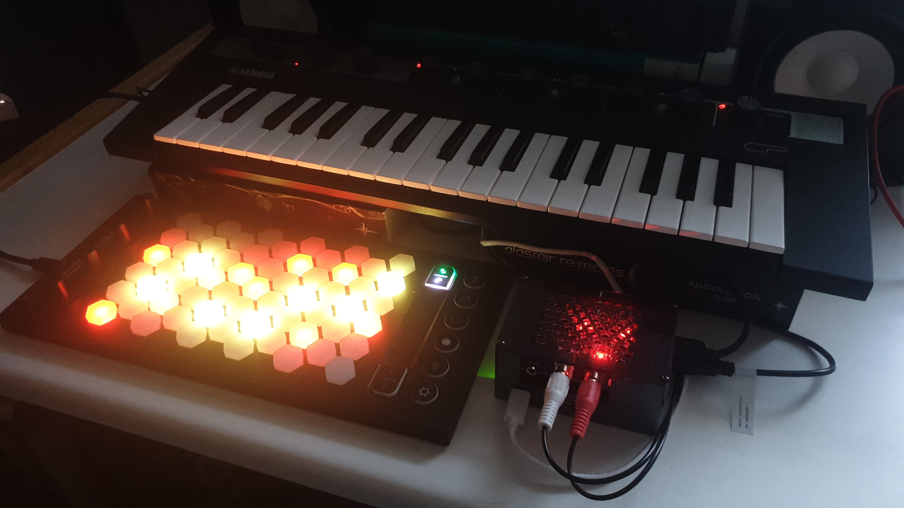

# microtonOS
Making a xenharmonic synth out of a Raspberry Pi

## Hardware
- Yamaha Reface CP
	- Official power supply---12.0V, 0.7A, and 8.4W (included with Reface CP) 
- Intuitive Instruments Exquis
	- USB-c to USB-A cable (included with Exquis)
- Raspberry Pi 5 8GB RAM
- Raspberry Pi 5 official powersupply---5.1V, 5.0A/9.0V, 3.0A/12.0V, 2.25A, 15.0V 1.8A, and 27W
- Inno-Maker Pi 5 Aluminum Case (with integrated fan/heatsink)
- Geeekpi GPIO pin header extension
- HifiBerry ADC plus DAC
- USB-B to USB-A cable
- Stereo RCA to 3.5mm TRS female cable
- 2 3.5 mm TRS male to 3.5 mm TRS male cables
- Headphones
- CME WiDi DIN-5
- Sandisk 32GB SD card

## Software
- Python 3
	- mido
	- mstsespy
	- rtmidi
	- signal
	- subprocess
	- sys
	- time
- Modartt Pianoteq 8 STAGE
- tuneBfree (remove msse flags when installing)
- Surge XT
- SonoBus
- Cadence
- Claudia
- jackd2
- Qjackctl
- MTS-ESP shared object (specific for Raspberry Pi, see mtsespy)
- Blueman
- librespot
- cargo
- Raspberry Pi OS (Bookworm) 64bit

## Literature
- *Inside Arabic Music* and maqamworld.org. The book contains additional information on tuning and sayr (modulation pathways).
- *The Real Arab Book* by Jacob Nakav
- Xen Wiki
- Wikipedia
- Scala website
- Oud for guitarists
- Adam Neely
- Learning Lumatone
- Zhea(nna) Erose
- Tolgahan Cogulu
- Between the Lines
- Encyclopedia Iranica
- Anuja Kamat
- Amir El Saffar
- Tarek Yamani
- Maya Youssef
- koramusic.org
- sevish.com
- Tonalsoft Encyclopedia

## Installation
- Note that this installation has not been tested on multiple devices and is unlikely to work out of the box.
- Download the software above and install the software above.
	- Python packages should be installed in a virtual environment at /home/pi/.venv/
- The username should be 'pi'.
- Install config files and systemd files with 'update_*.sh' scripts.

## Presets

### Tuning

**12edo.** Used in contemporary music. Limited use in classical Chinese music.

**24edo.** Used in contemporary arabic music.

**17edo.** Approximates classical Iranian music.

**29edo.** Approximates classical Arabic music.

**9ed3/2.** Wendy Carlos's Alpha Scale. Can also be used to approximate maqam Saba in Arabic music.

**19edo.** Approximates 1/3 meantone tuning used in classical European music from the 1600s.

**31edo.** Approximates 1/4 meantone tuning used in classical European music from the 1600s.

**13ed3.** Bohlen--Pierce Scale used in experimental music.

**7edo.** Used in Bantu music (e.g. in Zimbabwean music).

**5edo.** Used in Bantu music (e.g. in Ugandan music) and Indonesian classical music

**9edo.** Approximates Indonesian classical music.

**53edo.** Approximates Indian classical music. Also approximates Turkish music and music from the Western Sahel (e.g. Mali).

### Layouts

**Exquis.** Similar to Gerhard and harmonic table.

**Accordion B.**

**Accordion C.**

**Wicki-Hayden.** Used on some bandoneóns.

**Jazz.** Not in use elsewhere what I know of. Good for playing jazzy chords and shell voicings. Semi-isomorphic (i.e. you have to learn two shapes for each chord rather than 1).

## Communities
- Exquis/Dualo Discord and forum
- Zynthian forum and wiki
- Xenharmonic Alliance Discord
- Surge Discord
- Modartt forum
 

## Alternatives and Future Work
- The Korg Minilogue XD would be a good alternative to the Reface CP as it does have full microtonal support.
Other hardware synths with microtonal or MPE capabilities include other synths by Korg, synths by Sequential (e.g. Take Five) and Modal Electronics (e.g. Cobalt8), Dreadbox Nymphes, the ASM Hydrasynth, and Roland FP-30X (you have to look deep into the manual), which is a digital piano.
- There are multiple alternative isomorphic keyboards.
The best option is probably from Novation (e.g. the Launchpad X), but other pad controllers and grooveboxes such as Ableton Push or Polyend could work as well for a square layout.
More pricey options for square layouts include the Linnstrument and the Deluge.
More pricey options for a hexagonal layout includes Lumatone and Starr Labs.
C-thru may also be affordable for a hexagonal layout but it does not have LEDs and is no longer in production.
Chromatone is another non-LED option for a hexagonal layout, so are digital accordions produced by e.g. Roland.
- Other Raspberry Pi kits include Zynthian, Blokas Patchbox OS with or without Blokas PiSound, Squishbox.
- Hpi Instruments software/hardware aldo does microtonal transformation (midi) as does Tubbutec (for modular synths).
- Xentotune by Naren Ratan. Together with boss pedal and guitar.

## Mistakes and Dead Ends
- Reface CP does allow microtuning but only monophonically, maybe I should have gotten a Korg Minilogue XD instead?
- Blokas Midihub was meant to retune the Reface CP and it can do this, but I should just have gone directly to buying a Raspberry Pi 5 instead.
- Raspberry Pi 4, I had a good deal for, but you really want the CPU of the 5.
- Non-DIY approaches to sound modules do not seem feasible, e.g., Midiplus PianoEngine seems like the best piano module that could act microtonally (through GM), but it does not seem that good.
There are multiple decent organ modules, e.g. the Ferrofish B4000+, but they do not support polyphonic microtonality for more than 3 channels and those channels would have different timbres as they correspond to upper and lower manuals as well as pedals.

## Appendix

### Tuning Standards

|    | polyphony | midi | dynamic
|----|-----------|------|--------
| pitchbend | no | yes | yes
| midi polyphonic expression (MPE) | 15 | yes | yes
| general midi (GM1, GM2) | 14--15 | yes | yes
| multitimbral (not guaranteed!) | 16 | yes | yes
| midi tuning standard (MTS) | 127--127x16 | yes (sysex) | both dynamic and static
| midi tuning standard extraperipheral sensing (MTS-ESP) | 127--127x16 | no (shared object for Linux/Mac/Windows) | both dynamic and static
| Scala files (.scl + .kbm) | limited by other components | no (Linux/Mac/Windows file) | no
| Tuning file (.tun) | limited by other components | no (Linux/Mac/Windows file) | no
