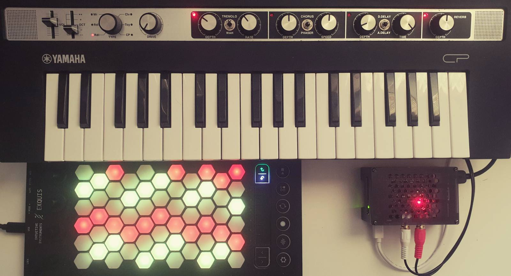

# microtonOS

Making a xenharmonic synth out of a Raspberry Pi.
Most microtonal/xenharmonic products are geared towards music production---microtonOS is not.
microtonOS is a synthesiser meant for jamming.
You can jam by yourself and discover different music cultures as well as experimental approaches to harmony.
Or, you can use one of the many connectivity options on the Raspberry Pi to add additional instruments played by friends.
At first glance, microtonOS is ticking all the boxes.
It is a knob-per-function synthesiser with carefully selected presets.
Furthermore, it is screen-free, and, at its height, visual feedback is a somewhat culture-agnostic geometric representation of the tuning system.
The microtonOS code can be readily adapted to work with a minimum hardware requirement of 1 midi controller + 1 Linux computer.

## Hardware
- Yamaha Reface CP
	- Official power supply---12.0V, 0.7A, and 8.4W (included with Reface CP) 
- Intuitive Instruments Exquis
	- USB-c to USB-A cable (included with Exquis)
- Raspberry Pi 5 8GB RAM
- Raspberry Pi 5 official powersupply---5.1V, 5.0A/9.0V, 3.0A/12.0V, 2.25A, 15.0V 1.8A, and 27W
- Inno-Maker Pi 5 Aluminum Case (with integrated fan/heatsink)
- Geeekpi GPIO pin header extension
- HifiBerry ADC plus DAC
- USB-B to USB-A cable
- Stereo RCA to 3.5mm TRS female cable
- 2 3.5 mm TRS male to 3.5 mm TRS male cables
- Headphones
- CME WiDi DIN-5
- Sandisk 32GB SD card

## Software
- Python 3
	- mido
	- mstsespy
	- rtmidi
	- signal
	- subprocess
	- sys
	- time
- Modartt Pianoteq 8 STAGE
- tuneBfree (remove msse flags when installing)
- Surge XT
- SonoBus
- Cadence
- Claudia
- jackd2
- Qjackctl
- MTS-ESP shared object (specific for Raspberry Pi, see mtsespy)
- Blueman
- librespot
- cargo
- Raspberry Pi OS (Bookworm) 64bit

## Installation
- Note that this installation has not been tested on multiple devices and is unlikely to work out of the box.
- Download the software above and install the software above.
	- Python packages should be installed in a virtual environment at /home/pi/.venv/
- The username should be 'pi'.
- Install config files and systemd files with 'update_*.sh' scripts.

### Customisation
For usage with other software and hardware synthesisers, it is useful to know something about [tuning standards](learn/tuning_standards.md).

## Tuning Presets
By default, the top note is concert A (440 Hz), but this can be changed according to step size.
Equally divided octave (also known as equal temperament) is abbreviated as edo.
Other intervals can alse be equally divided.
The tuning presets are assigned to four different classes:
(1) Default contains 12edo and white keys on the piano correspond to white lights on the Exquis.
(2) Microtonal contains equal-step tunings with a step size smaller than one semitone (100 cents).
White keys on the piano have red light, black keys have yellow light.
(3) Macrotonal contains equal-step tunings with a step size larger than one semitone.
White keys on the piano have green light, black keys have cyan light.
Only every other octave (or other period) is lit.
(4) Unequal contains tunings with non-equal step sizes.
White keys on the piano have magenta light, black keys have blue light.
If the step size is larger than one semitone, only every other period is lit.

<b>5edo (macrotonal).</b>
Used in [Bantu traditional music](learn/bantu.md) (e.g. in Ugandan music) and [Indonesian classical music](learn/indonesian.md).

<b>7edo (macrotonal).</b>
Used in [Bantu traditional music](learn/bantu.md) (e.g. in Zimbabwean music).

<b>13ed3 (macrotonal).</b>
Bohlen--Pierce scale.
Used in experimental music.

<b>9edo (macrotonal).</b>
Approximates [Indonesian classical music](learn/indonesian.md).

<b>Pythagorean (unequal).</b>
Ancient tuning that seems to have been discovered independently by different cultures.
Some intervals sound really consonant, but the problem is that others sound very dissonant.
That is the problem that equal step tunings solve.
See [just intonation](learn/just_intonation.md).

**12edo (default).** Used in contemporary music.
Was independently discovered in [Europe](learn/european.md) and [China](learn/east_asian.md).
Used in [American urban music](learn/american.md).
Used in [Romani traditional music](learn/romani.md).
Approximates [Ethiopian classical music](learn/ethiopian.md).

<b>9ed3/2 (microtonal).</b>
Wendy Carlos's Alpha Scale. Can also be used to approximate maqam saba in [Arabic music](learn/arabic.md).

<b>17edo (microtonal).</b>
Approximates [Iranian classical music](learn/iranian.md).

<b>9edo-ombak (unequal).</b>
An 18-note superset of 9edo.
When ascending every other note is 10 Hz lower than the next resulting in stretched octave.
Used in [Indonesian classical music](learn/indonesian.md) as an alternative to 9edo.

<b>19edo (microtonal).</b>
Approximates 1/3 meantone tuning used in [European classical music](learn/european.md) from the 1600s.
The minor and major third closely approximates their justly tuned counterparts, but the cost is that the fifth is not close to its justly tuned counterpart.

<b>Partial 48edo (unequal).</b>
A 19-note subset of 48edo.
Used in contemporary [Turkish music](learn/turkish.md).

<b>22edo (microtonal).</b>
Used in experimental music.

<b>Partial 53edo (unequal).</b>
A 22-note subset of 53edo.
Approximates [Indian classical music](learn/indian.md) well---in particular, its 22 shrutis.
Used in [Turkish classical music](learn/turkish.md).
After to 12edo, it is the tuning that can approximate the largest number of traditional musics including (apart from Indian and Turkish):
[West-Sahelian classical music](learn/west_sahelian.md) and
[East-Asian classical music](learn/east_asian.md).

<b>24edo (microtonal).</b>
Used in contemporary [Arabic music](learn/arabic.md).

<b>29edo (microtonal).</b>
Approximates [Arabic classical music](learn/arabic.md).

<b>31edo (microtonal).</b>
Approximates 1/4 meantone tuning used in [European classical music](learn/european.md) from the 1600s.
Closely approximates the harmonic seventh (the seventh harmonic in just intonation).

## Layout Presets
$d$ is a dilation parameter.
A suitible value is the size of the minor or neutral third.
For a more jazzy sound, try the major third or perfect fourth.
Below, the presets are named after the layout for $d=3$.

**Exquis.**
$d=3$ is the Exquis default layout.
How the number of steps depend on d is shown by arrows.
Number of steps for d=3 is also given as an example in the centres of the hexagons.
$d=3$ plus left--right flip is the Gerhard layout used in Shiverware's Musix Pro.

To the right, you can see a suggestion on how to map the hexagonal layout to a rectangular layout.
$d=5$.
This is the layout used on a bass guitar in standard tuning. 

**Harmonic table.**
$d=3$ is the harmonic table.
The harmonic table has been used in C-thru's AXiS controllers as well as in the Lumatone controller.
$d=2$ is the Park layout used in Shiverware's Musix Pro.

**Wicki--Hayden.**
$d=3$ is the Wicki--Hayden layout. For calculations, see below. The Wicki--Hayden layout is used in concertinas although it was originally designed for the bandoneón (popular in Argentine tango).
The bandoneón typically uses a non-isomorphic layout that is different between the left and right hands as well as whether the instrument is squeezed or dragged. Life is short so we will ignore such complex layouts.

$f_3$ is defined by

$$f_3(d)=\mathrm{round}\frac{d}{3} \mathrm{if\ } d\mod 3 > 0$$

$$f_3(d)= \max(i\in\mathbf{N}: i\mod 2 > 0, 1 \leq i < \frac{d}{3}) \mathrm{otherwise}$$

where $\mathrm{round}(x)$ rounds $x$ to the nearest integer and $x \mod y > 0$ if and only if $x$ is not divisible by $y$.
It is easiest to break this down into two cases.
If $d$ is not divisible by $3$, $f_3(d)$ is the integer nearest the fraction $d/3$.
Otherwise, it is the largest odd integer less than $d/3$.
For example, if you want to use $d=6$ for 24edo and you use $\mathrm{round}(d/3)$ instead (as in the first case), the layout will only use half of the tones and be equivalent to 12edo.

**Jankó.**
Bosanquet--Wilson layouts.
$d=3$ is the Jankó layout.
$d=4$ is the type C accordion layout.
Both $d=3$ and $d=4$ are given as examples below.
$d=4$ plus left--right flip corresponds to both the type B accordion layout and the dugmetara layout (popular in the Balkans).
$d=5, 6, 8,$ and $13$
correspond to the Lumatone presets for 19edo, both 22edo and 24edo, 31edo, and 53edo respectively. 

## Learn More

Different kinds of [microtonal instruments](learn/microtonal_instruments.md).

[Isomorphic keyboards](learn/isomorphic_keyboards.md) that are or have been in production.

Making [xenharmonic chord progressions](learn/xenharmonic_chords.md).

## Roadmap
- [ ] Add support for a second manual.
- [ ] Add support for microtonal autotuning. Likely involves using AutoTalent or XentoTune as a plugin in Guitarix.
- [ ] Custom tunings should generate intuitive mappings to Halberstadt keyboards.
- [ ] Add MTS-ESP support to Aeolus and foo-yc organs if the workload is managable.

## Communities
- Exquis/Dualo Discord and forum
- Zynthian forum and wiki
- Xenharmonic Alliance Discord
- Surge Discord
- Modartt forum

## Literature
- *Inside Arabic Music* and maqamworld.org. The book contains additional information on tuning and sayr (modulation pathways).
- *The Real Arab Book* by Jacob Nakav
- Xen Wiki
- Wikipedia
- Scala website
- Oud for guitarists
- Adam Neely
- Learning Lumatone
- Zhea(nna) Erose
- Tolgahan Cogulu
- Between the Lines
- Encyclopedia Iranica
- Anuja Kamat
- Amir El Saffar
- Tarek Yamani
- Maya Youssef
- koramusic.org
- sevish.com
- Tonalsoft Encyclopedia
 

## Alternatives and Future Work
- The Korg Minilogue XD would be a good alternative to the Reface CP as it does have full microtonal support.
Other hardware synths with microtonal or MPE capabilities include other synths by Korg, synths by Sequential (e.g. Take Five) and Modal Electronics (e.g. Cobalt8), Dreadbox Nymphes, the ASM Hydrasynth, and Roland FP-30X (you have to look deep into the manual), which is a digital piano.
- There are multiple alternative isomorphic keyboards.
The best option is probably from Novation (e.g. the Launchpad X), but other pad controllers and grooveboxes such as Ableton Push or Polyend could work as well for a square layout.
More pricey options for square layouts include the Linnstrument and the Deluge.
More pricey options for a hexagonal layout includes Lumatone and Starr Labs.
C-thru may also be affordable for a hexagonal layout but it does not have LEDs and is no longer in production.
Chromatone is another non-LED option for a hexagonal layout, so are digital accordions produced by e.g. Roland. For a gallery, see these [isomorphic keyboards](learn/isomorphic_keyboards.md).
- Other Raspberry Pi kits include Zynthian, Blokas Patchbox OS with or without Blokas PiSound, Squishbox.
- Hpi Instruments software/hardware aldo does microtonal transformation (midi) as does Tubbutec (for modular synths).
- Xentotune by Naren Ratan. Together with boss pedal and guitar.

## Mistakes and Dead Ends
- Reface CP does allow microtuning but only monophonically, maybe I should have gotten a Korg Minilogue XD instead?
- Blokas Midihub was meant to retune the Reface CP and it can do this, but I should just have gone directly to buying a Raspberry Pi 5 instead.
- Raspberry Pi 4, I had a good deal for, but you really want the CPU of the 5.
- Non-DIY approaches to sound modules do not seem feasible, e.g., Midiplus PianoEngine seems like the best piano module that could act microtonally (through GM), but it does not seem that good.
There are multiple decent organ modules, e.g. the Ferrofish B4000+, but they do not support polyphonic microtonality for more than 3 channels and those channels would have different timbres as they correspond to upper and lower manuals as well as pedals.

