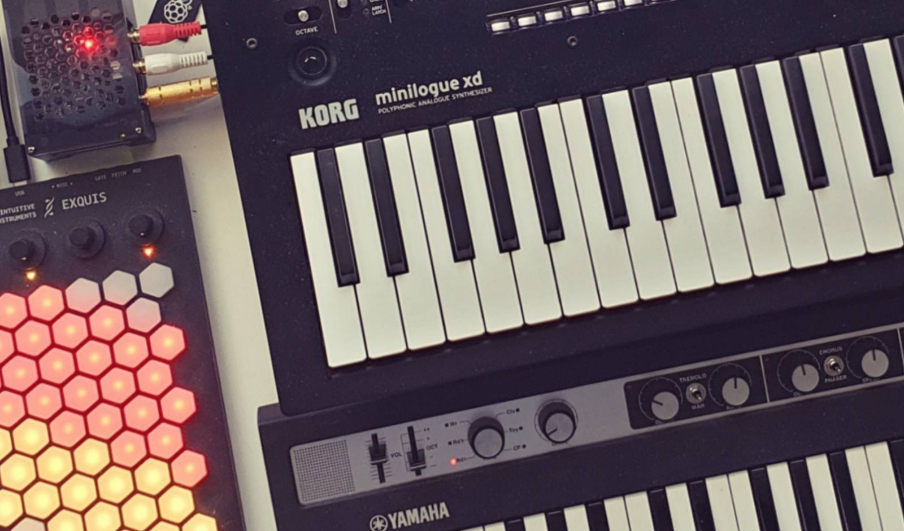

> [!warning]
> This branch is undergoing a major overhaul.
> For something more akin to a stable branch see exquis1_2_0.s.

# microtonOS

Making a xenharmonic synth out of a Raspberry Pi.
Most microtonal/xenharmonic products are geared towards music production—microtonOS is not.
microtonOS is a synthesiser meant for jamming.
You can jam by yourself and discover different music cultures as well as experimental approaches to harmony.
Or, you can use one of the many connectivity options on the Raspberry Pi to add additional instruments played by friends.
At first glance, microtonOS is ticking all the boxes.
It is screen-free, and, at its height, visual feedback is a somewhat culture-agnostic geometric representation of the tuning system.
The microtonOS code can be readily adapted to work with a minimum hardware requirement of 1 MIDI controller + 1 Linux computer.
Below is a brief demo of maqam saba in 9ed3/2 tuning on piano.

https://github.com/user-attachments/assets/df7541df-ebf6-41b0-8a2d-45e2938c4093

**Under reconstruction. See `docs` for more info.**
