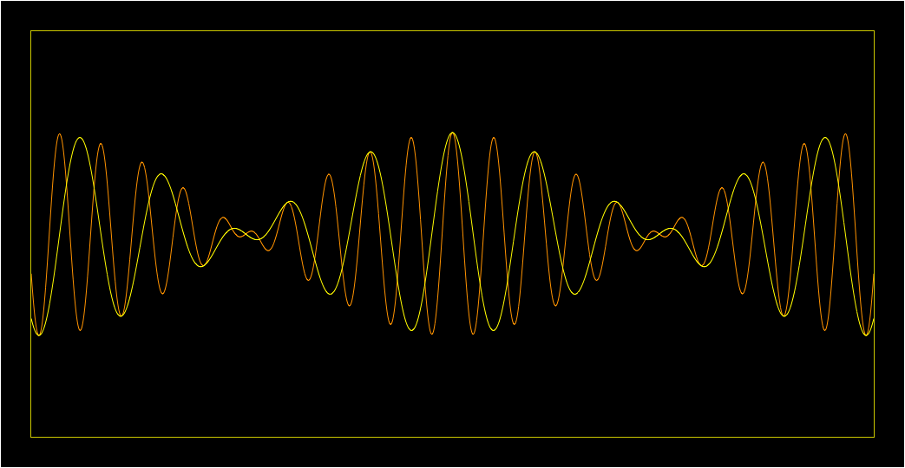
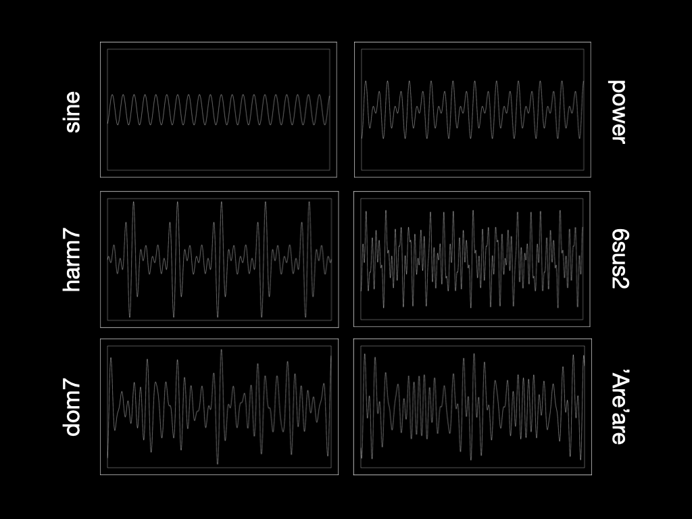

# Chords

> [!warning]
> These are like my opinions, man. Not some kind of universal theory of human aesthetical preferences in harmony.

- Tension and release

## Equal

- planing
- constant structures
- line clichés

Constant beating across an "octave-on-average".

## Harmonic

## Pythagorean

|style     |voices (in 12edo)|fifths (number of)|
|----------|-----------------|------------------|
|rock, metal, many traditional musics|7|0|
|pop, hip hop, European classical music, and many more|3,4,5|1 to 2|
|jazz, RnB|2,3,4,5|2 to 5|
|flamenco|2,3,4,5|1 to 6|
|salsa, tango|8,9|2 to 3|
|12-tone music|any|unlimited|

## Repetition legitimises

Below, degree is the number of steps in an equal division. It does not matter precisely, but each degree is around 350¢/2=175¢. In other words, it's a kind of average between one and two semitones.

| Degree | Pyth- | agorean                            | harm- | onic   |
| ------ | ----- | ---------------------------------- | ----- | ------ |
| 1      | ±0    |                                    | 4     |        |
| 2      | +2    | 2                                  |       |        |
| 3      | +4    |                                    | 5     | ±\*    |
| 4      | -1    | 4,11                               |       |        |
| 5      | +1    |                                    | 6     |        |
| 6      | -4    | &flat;6,&flat;13                   |       |        |
| 7      | -2    | 7                                  | 7     | harm7  |
| 8      | ±0    |                                    | 8     |        |
| 9      | +2    | 2,9                                | 9     | 9      |
| 10     | +4    |                                    | 2x5   | ±\*    |
| 11     | +6    | &sharp;4,&sharp;11                 | 11    | harm11 |
| 12     | +1    |                                    | 2x6   |        |
| 13     | +3    | 6,13                               | 13    | harm13 |
| 14     | +5    | maj7                               | 15    | neu7   |
| 15     | +7    | &flat;2,&flat;9,&sharp;8,&sharp;15 | 17    | harm15 |
| 16     | -3    | m\*,min\*                                | 19    | -\*    |

Note that susX replaces the major third with X, and symbols marked with \* also replace the major third. If a Pythagorean symbol is empty, it means that it's inherent. If a harmonic symbol is empty, it means that its not defined.

